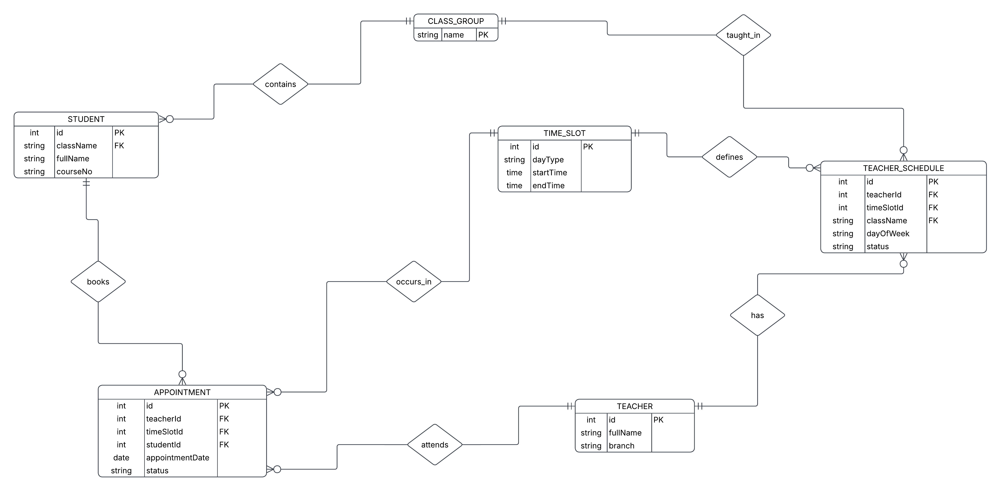

# Tutor Schedule App

A scheduling and appointment system built for a cram school. It replaces a paper weekly schedule with a local web app used by the guidance counselor to manage teacher availability and book one-on-one student sessions.

## Status

Work in progress. Started July 2026, built alongside coursework as a self-directed summer project.

## What it does

- Guidance counselor manages the teacher list, including subject/branch info.
- Teacher weekly availability is entered manually and stored — which slots are busy (with which class), free, or blocked (teacher off that day/hour).
- Weekday and weekend hours can differ.
- Student records are imported from an Excel file (name, course number, class), and classes are created automatically from that data.
- One-on-one appointments are booked against a real calendar date, checked against the teacher's weekly grid, with conflict prevention — no double-booking the same slot.
- Appointments can be cancelled.
- Weekly and daily teacher schedules can be exported to Excel in a printable layout.
- Teachers and students can be added in bulk.
- Database backups are taken automatically (on app startup and whenever a schedule is saved) and can be restored from a saved dump.
- Runs locally, on the guidance counselor's machine — not deployed to the internet.

## Tech stack

- Java 17
- Spring Boot 3.5.16
- Spring Data JPA / Hibernate
- Thymeleaf
- MySQL
- Apache POI (Excel import/export)
- Docker (containerized setup, planned)

## Data model



Six entities: `Teacher`, `Student`, `ClassGroup`, `TimeSlot`, `TeacherSchedule`, `Appointment`. `ClassGroup` uses the class name itself as its primary key since class names (e.g. `12-D MF`) come directly from the Excel import rather than being generated. `TeacherSchedule` links a teacher to a time slot and, when occupied, to the class being taught at that time — separate from `Appointment`, which represents a single one-on-one session tied to a specific calendar date.

## Running it — for the guidance counselor

No installation, no commands. Double-click `run.bat` on the desktop. It starts MySQL if it isn't already running, launches the app, and opens it in the browser automatically at `http://localhost:8080`.

## Running it — for development

1. Clone the repo.
2. Create a MySQL database:
   ```sql
   CREATE DATABASE tutor_schedule_db;
   ```
3. Copy `application.properties.example` to `src/main/resources/application.properties` and fill in your local MySQL username and password.
4. Run:
   ```
   ./mvnw spring-boot:run
   ```
5. Open `http://localhost:8080`.

To produce the packaged version used by `run.bat`:
```
./mvnw clean package
```
This generates a runnable `.jar` under `target/`, which `run.bat` calls with `java -jar`.

## Notes

- `application.properties` is gitignored — it holds real database credentials and should never be committed. Use `application.properties.example` as a template.
- No user data (student names, course numbers) is committed to this repo. The app is tested with placeholder data.