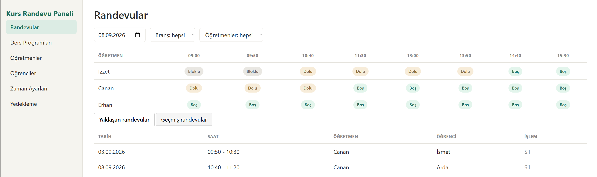
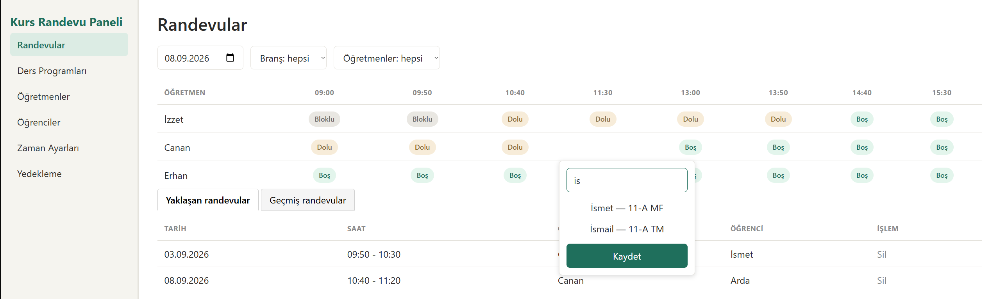
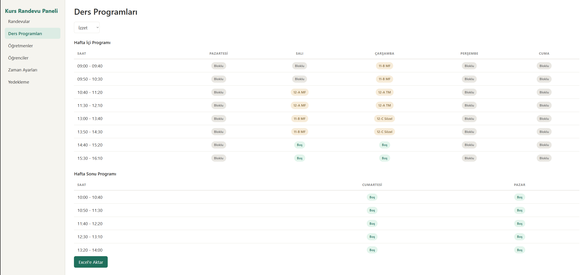
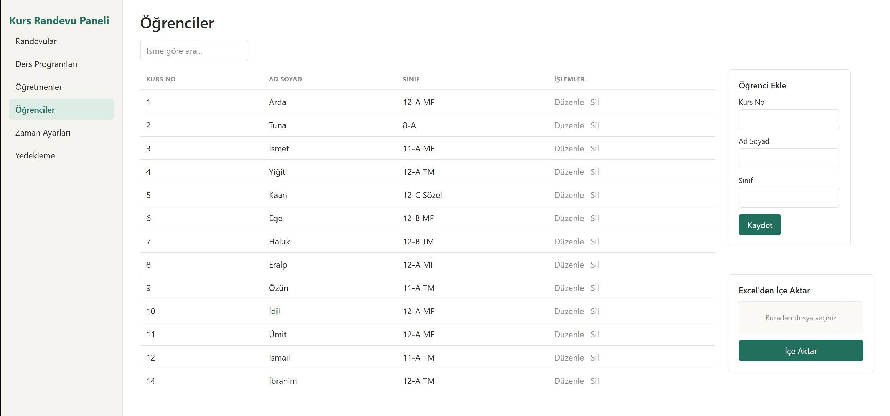
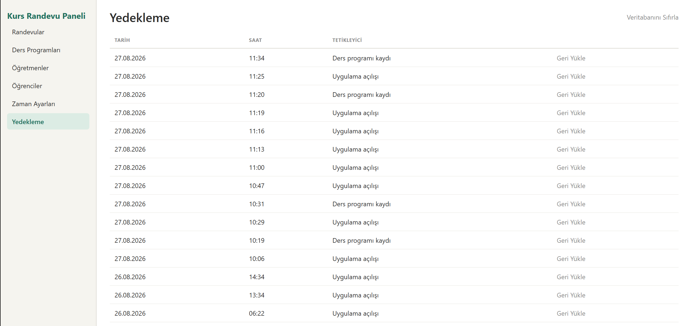
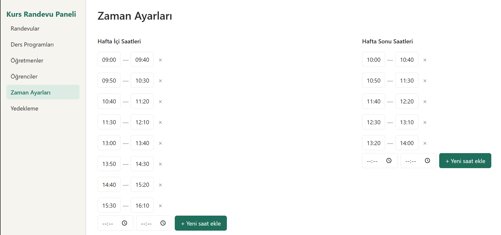
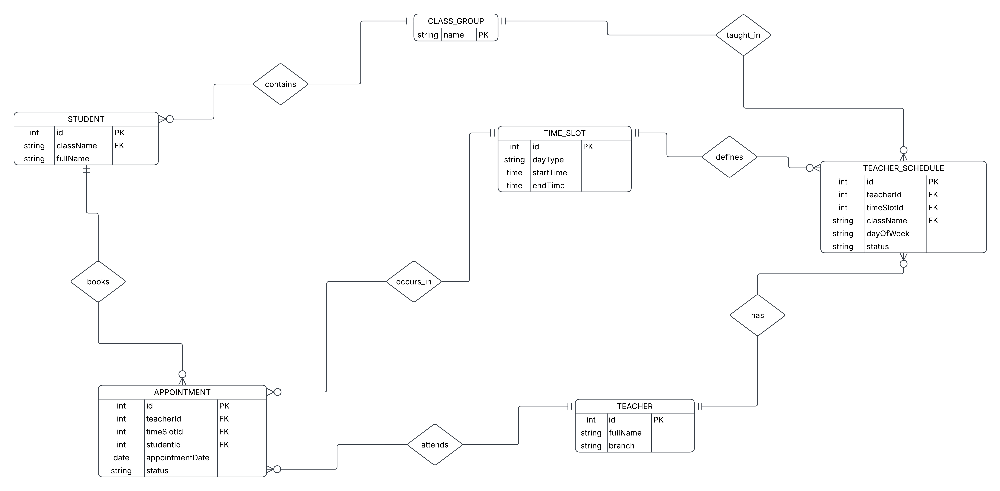

# Tutor Schedule App

[](https://github.com/ardaozkaranfil/tutor-schedule-app/actions/workflows/ci.yml)

A scheduling and appointment system built for a tutoring center. It replaces a paper weekly schedule with a local web app used by the guidance counselor to manage teacher availability and book one-on-one student sessions.

## Status

Finished and in active use — currently running at 2 tutoring centers. Built between July–August 2026 alongside coursework as a self-directed summer project.

The interface is in Turkish, since that's the language of the people using it. The code, commits and this README are in English.

## Screens


*The daily view: every teacher's slots for the selected date, with the upcoming appointments below.*


*Clicking a free slot opens an inline form with live student search — booking is checked against the teacher's weekly grid, so the same slot can't be taken twice.*


*A teacher's weekly grid — each cell is free, blocked, or occupied by a class. Weekday and weekend hours are configured separately.*

<details>
<summary>More screens</summary>


*Student list, with bulk import from Excel.*


*Every backup is listed with what triggered it, and can be restored from here.*


*Lesson hours aren't hardcoded — they're edited per school year.*

</details>

Early UI planning is in [`docs/ui-mockup.pdf`](docs/ui-mockup.pdf) — a design-stage mockup, not a screenshot of the working app.

## What it does

- Guidance counselor manages the teacher list, including subject/branch info.
- Teacher weekly availability is entered manually and stored — which slots are busy (with which class), free, or blocked (teacher off that day/hour).
- Weekday and weekend hours can differ.
- Student records are imported from an Excel file (name, course number, class), and classes are created automatically from that data.
- One-on-one appointments are booked against a real calendar date, checked against the teacher's weekly grid, with conflict prevention — no double-booking the same slot.
- Appointments can be cancelled.
- Weekly and daily teacher schedules can be exported to Excel in a printable layout. The weekly export also overlays that calendar week's one-on-one appointments onto the grid (student name in the booked slot) and appends a summary table of the week's appointments (date, day, time, student, class).
- Teachers and students can be added in bulk.
- Database backups are taken automatically (on app startup and whenever a schedule is saved) and can be restored from a saved dump.
- Class groups can be created on the fly from the student add/edit form, not just via Excel import.
- Student and teacher lists have a name search bar.
- The database can be reset for a new school year (triple-confirmation to prevent accidental data loss), with old backups retained.
- Runs locally, on the guidance counselor's machine — not deployed to the internet.

## Tech stack

- Java 21
- Spring Boot 3.5.16
- Spring Data JPA / Hibernate
- Thymeleaf
- MySQL
- Apache POI (Excel import/export)
- JUnit 5 / Mockito (unit tests), Spring MVC Test (`@WebMvcTest`) and `@DataJpaTest` (slice tests), H2 (in-memory test database), JaCoCo (coverage)
- Postman (manual API testing/collection)
- Docker (app + MySQL containers via docker-compose)

## Running it — for the guidance counselor

No commands to type. Docker Desktop has to be installed once on the machine (see "First-time setup" below); after that, running the app is a double-click on `run.vbs`.

It checks whether Docker Desktop is running and starts it if it isn't, waits for the Docker daemon to become available, brings up the app and its MySQL database as containers (`docker compose up -d`), waits until the app answers, then opens it in the browser at `http://localhost:8080/appointments`. If any of those steps fails, a message box in Turkish explains what went wrong rather than the script failing silently.

`run.vbs` is a thin wrapper around `run.bat`: it runs it with no console window, which is what makes it the right thing to keep as a desktop shortcut, and turns the script's exit code into that message box. `run.bat` can also be double-clicked directly — in that case progress and errors stay visible in the console window instead.

Stopping it isn't part of the daily routine — both containers use `restart: always`, so the app comes back on its own after a reboot. `stop.bat` exists for maintenance and shuts both containers down (`docker compose down`); the database volume and the `backups/` folder survive it.

### First-time setup on a new machine

Setting up a new center takes about fifteen minutes, most of it waiting.

1. **Install Docker Desktop** for Windows and let it finish its first start. It's the only thing that gets installed — Java, Maven and MySQL all live inside the containers.
2. **Copy the project folder** onto the machine, somewhere stable: not the Desktop, not inside a cloud-synced folder.
3. **Create `.env`** next to `docker-compose.yml` by copying `.env.example` and filling in `DB_NAME` and `DB_PASSWORD`. Each center gets its own database and its own password; nothing is shared between installations.
4. **Double-click `run.vbs` and be patient.** The first run builds the app image from source and initialises the MySQL data directory, which takes several minutes on a fresh machine — far longer than any later start. `run.bat` only waits ~60 seconds for the app to answer, so this first time it may report that the app isn't responding while it is in fact still starting. Wait a couple of minutes and double-click again; from then on startup is quick.
5. **Put a shortcut to `run.vbs` on the desktop** and hand it over. That shortcut is the entire daily interface.

An internet connection is needed for step 1 and the first build only — everything after that runs offline.

<details>
<summary>run.bat exit codes</summary>

| Code | Meaning |
| ---- | ------- |
| 0 | Started successfully |
| 1 | Docker Desktop executable not found in any known install location |
| 2 | Docker daemon did not come up within ~3 minutes |
| 3 | `docker compose up -d` failed |
| 4 | Containers are up but the app never answered within ~60 seconds |

`run.vbs` maps each of these to a Turkish message box. Passing `quiet` as the first argument suppresses the final `pause`, which is how `run.vbs` invokes it — a hidden window can't be dismissed by the user.

</details>

## Running it — for development

**Option A — Docker (matches production/`run.bat`):**

1. Clone the repo.
2. Copy `.env.example` to `.env` and set `DB_NAME` / `DB_PASSWORD`.
3. Start both containers:
   ```bash
   docker compose up -d
   ```
4. Open `http://localhost:8080/appointments`.

**Option B — local MySQL (faster edit/rebuild loop):**

1. Clone the repo.
2. Create a MySQL database:
   ```sql
   CREATE DATABASE tutor_schedule_db;
   ```
3. Set `DB_PASSWORD` in your shell (and `DB_USER` too, if yours isn't `root`):
   ```
   # PowerShell
   $env:DB_PASSWORD = "your_local_mysql_password"

   # bash / zsh
   export DB_PASSWORD="your_local_mysql_password"
   ```
4. Run the app:
   ```bash
   ./mvnw spring-boot:run
   ```
5. Open `http://localhost:8080/appointments`.

## Data model



Six entities: `Teacher`, `Student`, `ClassGroup`, `TimeSlot`, `TeacherSchedule`, `Appointment`. `ClassGroup` uses the class name itself as its primary key since class names (e.g. `12-D MF`) come directly from the Excel import rather than being generated. `TeacherSchedule` links a teacher to a time slot and, when occupied, to the class being taught at that time — separate from `Appointment`, which represents a single one-on-one session tied to a specific calendar date.

## Testing

Tests are split across three layers, each isolating a different thing.

**Service layer — unit tests (JUnit 5 + Mockito).** Repositories and collaborating services are mocked, so these exercise business logic on its own (validation rules, schedule/availability calculations, Excel import/export mapping) without touching a database:

- `StudentServiceTest`, `TeacherServiceTest`, `TimeSlotServiceTest`, `ScheduleServiceTest`
- `ScheduleAvailabilityServiceTest`, `AppointmentServiceTest`
- `ExcelImportServiceTest`, `ExcelExportServiceTest` (using real in-memory Apache POI workbooks, not mocked)
- `BackupServiceTest` (covers the `restore()` guard clause only — the actual `mysqldump`/`mysql` process execution isn't unit-testable as currently structured)

**Controller layer — `@WebMvcTest` + MockMvc.** Services are replaced with `@MockitoBean`, so these check routing, request-parameter binding, the view name and model attributes each handler produces, JSON responses, redirects, and the flash messages shown when a service throws:

- `AppointmentControllerTest`, `ScheduleControllerTest`, `TeacherControllerTest`
- `StudentControllerTest`, `TimeSlotControllerTest`, `BackupControllerTest`

**Repository layer — `@DataJpaTest` against H2.** These verify that the derived query methods actually return what their names promise — case-insensitive and partial name matching, filtering, and ordering:

- `StudentRepositoryTest`, `TeacherRepositoryTest`, `TeacherScheduleRepositoryTest`
- `AppointmentRepositoryTest`, `TimeSlotRepositoryTest`, `ClassGroupRepositoryTest`

All three layers run against an in-memory H2 database (configured in `src/test/resources/application.properties`), so no local MySQL connection is needed:

```bash
./mvnw test
```

Every push and pull request to `main` also runs this via GitHub Actions (see `.github/workflows/ci.yml`).

Test coverage is measured with JaCoCo. Running `./mvnw test` also generates an HTML report at `target/site/jacoco/index.html` (not committed — regenerate it locally). Coverage across the service and controller layers is ~84% instructions / ~74% branches. The repository layer isn't in that figure: Spring Data repositories are interfaces with no implementation code of their own, so there's nothing for JaCoCo to measure.

### API testing with Postman

A Postman collection covering the app's JSON/file-download endpoints (student/teacher search, single-student lookup, Excel schedule export) is at `postman/tutor-schedule-app.postman_collection.json`.

To use it:

1. Import the collection into Postman.
2. The `baseUrl` collection variable is preset to `http://localhost:8080` — update it if the app runs on a different port.
3. Start the app (see "Running it — for development" above), then send any request in the collection.

Note: the Postman collection only covers the app's JSON/file-download endpoints (search, lookup, export) — the rest of the create/edit flows go through the Thymeleaf UI.

## Limitations and trade-offs

These are deliberate scope decisions rather than things left half-done, but they're real constraints and worth stating outright:

- **No authentication or user accounts.** The app runs on one trusted machine on the counselor's desk and is never exposed to the network, so a login screen would add daily friction without adding real protection. Opening it up to multiple users over a network would mean adding Spring Security and per-role permissions first — it isn't a config flag away.
- **Schema is managed by Hibernate (`ddl-auto=update`), not by migrations.** Workable for a single-developer app whose schema settled early, but schema changes aren't versioned or reviewable, and a destructive change wouldn't be caught before reaching live data. Flyway is the right fix if the schema starts moving again; the automatic backups are the current safety net.
- **Backups shell out to `mysqldump` / `mysql`** rather than being done in Java. Simple and reliable in practice, but it couples the app to the MySQL client binaries (installed in the Dockerfile) and makes that code path hard to unit-test — which is why `BackupService` coverage is thin.
- **No end-to-end coverage.** The service, controller and repository layers are each tested in isolation, but nothing exercises a full request against a real MySQL database. Controller tests assert view names and model attributes rather than the rendered HTML, so a template that produces the wrong output isn't caught by anything except manual checking.
- **`BackupControllerTest` writes to the real `backups/` folder** to test file listing, cleaning up after itself in a `finally` block. It works, but it means the test suite touches the working directory rather than a temp directory.
- **Single-instance by design.** Each tutoring center runs its own independent local installation with its own database. There is no sync or shared server between them, and the app was never built to serve multiple centers from one deployment.

## Notes

- `application.properties` is committed, but it only holds env-var references (`${DB_PASSWORD}` and friends) — real values come from `.env` for the Docker run, or from your shell environment for a local run. `.env` itself stays gitignored.
- No user data (student names, course numbers) is committed to this repo. The app is tested with placeholder data.
- CI runs on GitHub Actions against Java 21; see the badge above or the Actions tab for build status.
- Backups are timestamped in the app's container timezone (Europe/Istanbul), so file names reflect local time regardless of the host machine.